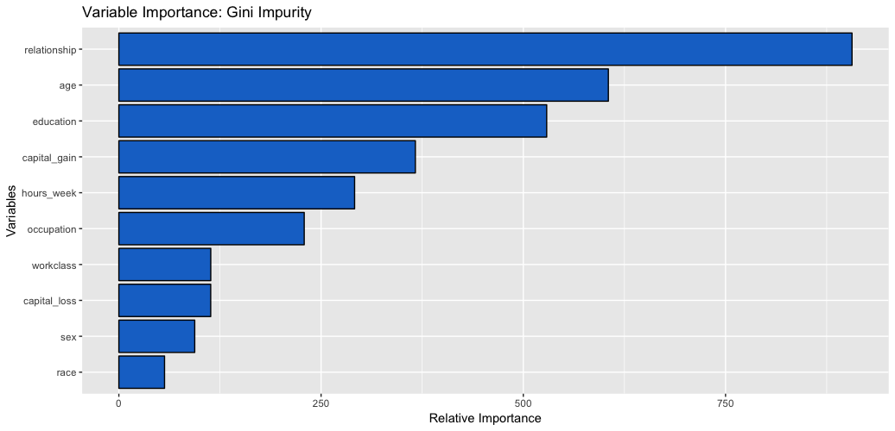
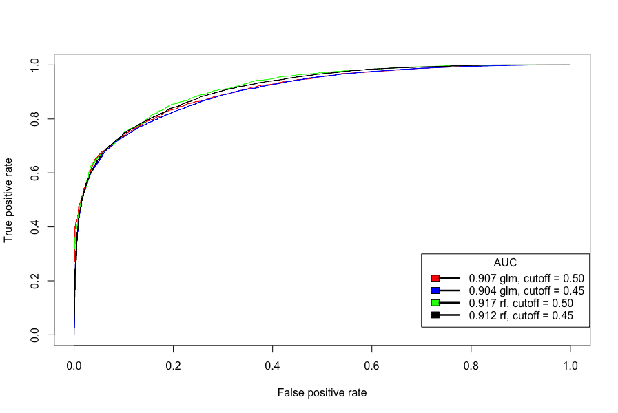

```{r setup, include=FALSE}
knitr::opts_chunk$set(echo = TRUE)
```

With 82 percent accuracy a random forest classifier will determine whether an individual makes more than, or less than fifty thousand dollars in 1996. A few of the most important drivers of salary classification are relationship status (husband, wife, unmarried), age, education level, and capital gain (figure 1). The final model was chosen over a few other high performing models. The deciding factors were

  1. Overall model accuracy - how many predictions did the model make that were actually correct decisions
  
  2. True positive rate (TPR), and true negative rate similarity (TNR) - how accurate is the model when it predicts salary less than 50k (positive class) and how accurate is the model when it predicts salary over 50k (negative class). Similar TPR and TNR tells us the model is not overfitting, or not favoring a certain class.
  
  3. High true positive rate and low false positive rate (FNR) - we want the model to perform well when classifying      the positive class at various false positives rate (figure 2). In this example, a false positive is predicting that someone makes a salary less than 50k when in fact they make more.
  
The random forest classifier with a cutoff threshold of 0.45 performs the best according to 1. and 2. above. It performs very similar to the other models for 3. It has high overall accuracy (82%), close balanced TPR (82%) and TNR (82%), and a high AUC (91%). Assuming that we are interested in similar TPR and TNR accuracy, this model is our best pick. However, if we want to increase the detection rate of a certain class (i.e: predict individuals making salary over 50k with a higher accuracy) a different model, or different cutoff threshold may be more suitable. The random forest classifier with 0.50 cutoff or the logistic regression classifier with 0.50 cutoff would be better options as they have higher TNR.







```{r echo=F}
load('writeup_data/model_comparisons.rda')
knitr::kable(model_metrics)
```


