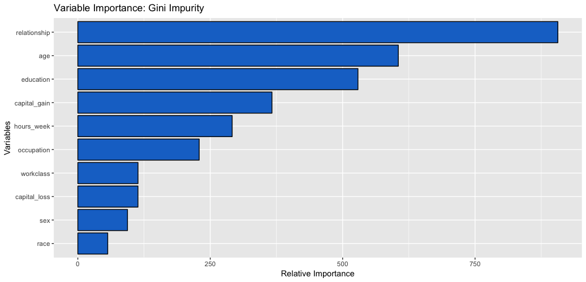
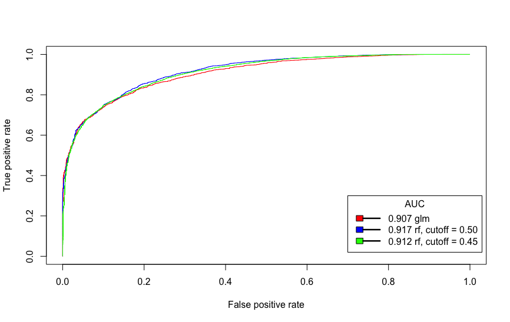

```{r setup, include=FALSE}
knitr::opts_chunk$set(echo = TRUE)
```
# \br\br

With 82 percent accuracy a random forest classifier will determine whether an individual makes more than, or less than fifty thousand dollars in 1996. A few of the most important drivers of this salary classification are relationship status (husband, wife, unmarried), age, education level, and capital gain. The final model was chosen over another high performing model: a logistic regression classifier. The deciding factors were <br><br>
1.	Overall model accuracy - how many predictions did the model make that were actually correct decisions  
2.	True positive rate (TPR), and true negative rate closeness (TNR) - how accurate is the model predicting individuals making under 50k (TPR) and how accurate is the model predicting individuals making over 50k (TNR). <br>

The random forest classifier with a cutoff threshold of 0.45 performs the best according to the criteria above. It has both high overall accuracy (82 %) and close balanced TPR (82%) and TNR (82.5%) Assuming that we are interested in similar TPR and TNR accuracy, this model is our best pick. However, if we want to increase the detection rate of a certain class (i.e: predict individuals making over 50k with a higher accuracy) a different model, or different cutoff threshold may be more suitable. The random forest classifier with 0.50 cutoff or the logistic regression classifier would be models to use in this case.

<div class = "row">
<div class = "col-md-6">
<br>

</div>
<div class = "col-md-6">

</div>
<div style="float: none; margin: 0 auto;">
```{r echo=F}
  load("model_metrics.Rda")
  knitr::kable(model_metrics, format = "html")
```
</div>
</div>


